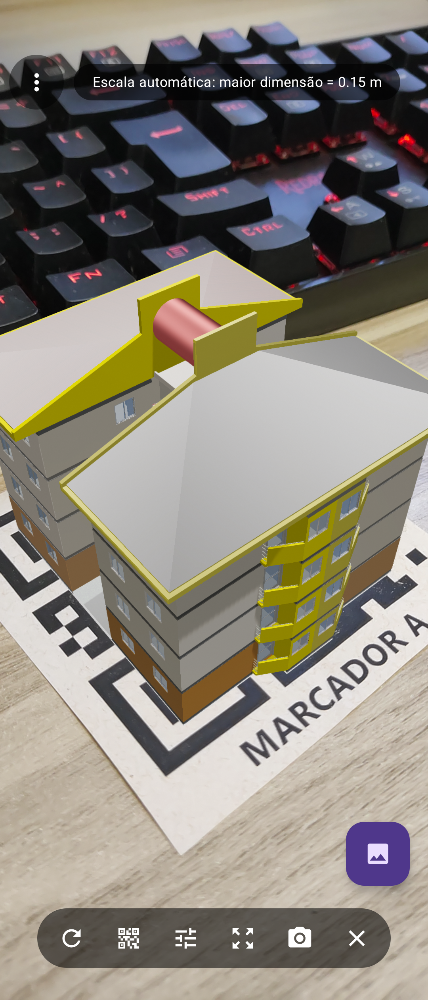
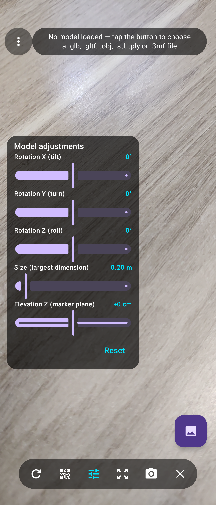
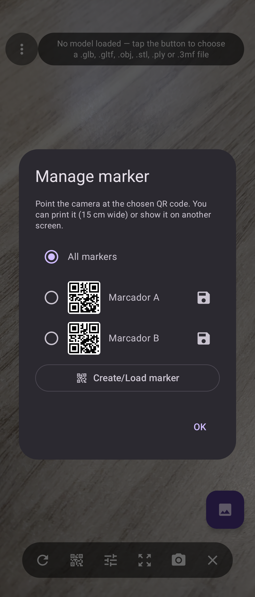
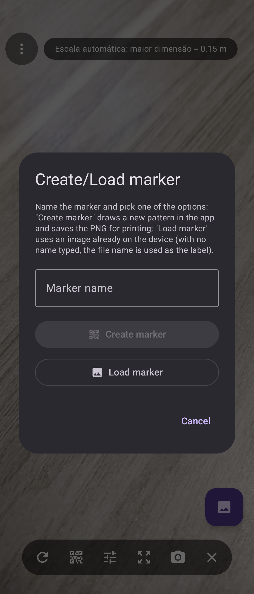

# ArkZ ARModelViewer

[](LICENSE)
[](https://github.com/em-rezende/Android-ArkZ-ARModelViewer/releases/latest)
[-3DDC84.svg)](#requisitos)
[](https://kotlinlang.org/)

**Repositório:** <https://github.com/em-rezende/Android-ArkZ-ARModelViewer> ·
**Licença:** [GPL-3.0](LICENSE) · **Autor:** Ark-Z Arquitetura Ltda

Aplicativo Android de **Realidade Aumentada** que renderiza modelos 3D
(`.glb`, `.gltf`, `.obj`, `.ply`, `.stl`, `.3mf`) **ancorados em marcadores de
imagem** (QR codes) detectados pelo **ARCore (Augmented Images)**.

* **Linguagem:** Kotlin
* **UI:** Jetpack Compose (Material 3)
* **RA + renderização:** [SceneView](https://github.com/sceneview/sceneview) `io.github.sceneview:arsceneview:4.38.0` (Filament)
* **Detecção de marcadores:** `com.google.ar:core:1.54.0`



*Tela principal — câmera + modelo 3D ancorado no marcador, com o menu ⋮ no canto
superior esquerdo e a faixa de status à direita dele.*

> As capturas foram feitas em mais de um idioma, justamente para mostrar que a
> interface **toda** acompanha o **Idioma** escolhido no menu ⋮
> (veja [Idiomas](#idiomas)).

---

## Requisitos

| Item | Versão |
|---|---|
| Android Studio | atual (usa AGP 9.4.0 / Gradle 9.7.1) |
| JDK | 21 (o daemon do Gradle provisiona o **JDK 25** sozinho — veja a nota abaixo) |
| Android SDK | compileSdk **37** (`platforms;android-37.0` + `build-tools;37.0.0`) |
| minSdk / targetSdk | 24 / 36 |
| Equipamento | aparelho (ou emulador) com suporte a ARCore + Google Play Services for AR |

> O `compileSdk 37` é uma exigência do SceneView 4.38.0 (validada via *AAR
> metadata*), não uma escolha do app.

> **JDK:** o build roda com o JDK 21 apontado por `JAVA_HOME`; o arquivo
> `gradle/gradle-daemon-jvm.properties` pede **Java 25** para o daemon e o Gradle
> **baixa e reaproveita** essa versão na primeira sincronização
> (`~/.gradle/jdks`), sem instalação manual. Para fixar outro JVM, use a tarefa
> `updateDaemonJvm` do Gradle (raiz do projeto).

---

## Como compilar e instalar

```bash
# Windows
gradlew.bat :app:assembleDebug

# macOS / Linux
./gradlew :app:assembleDebug
```

O `local.properties` precisa apontar para o seu SDK (`sdk.dir=...`); o Android
Studio cria/atualiza esse arquivo automaticamente ao abrir o projeto.

Se o SDK 37 ainda não estiver instalado:

```bash
sdkmanager "platforms;android-37.0" "build-tools;37.0.0"
```

### Observação sobre o AGP 9

O AGP 9 traz suporte a Kotlin embutido e, por padrão, **proíbe** o plugin
`org.jetbrains.kotlin.android`. Como este projeto usa o plugin do compilador
Compose (`org.jetbrains.kotlin.plugin.compose`) e configura `jvmTarget` no bloco
Kotlin, o `gradle.properties` desativa o Kotlin embutido:

```properties
android.builtInKotlin=false
android.newDsl=false
```

É exatamente a configuração usada pelo repositório oficial do SceneView com o
AGP 9.4.0. Os avisos informativos de deprecação ficam suprimidos por
`android.sync.suppressAgpWarnings=DEPRECATED_DSL`.

### APK de release (assinado)

O build de release é validado pelo `lintVitalRelease` e roda sem nenhuma
configuração extra:

```bash
gradlew.bat :app:assembleRelease   # Windows
./gradlew :app:assembleRelease     # macOS / Linux
```

Sem uma chave de assinatura o Gradle produz `app-release-unsigned.apk` em
`app/build/outputs/apk/release/` — um APK que **não** instala no aparelho (serve
para conferir que a variante de release compila e passa no lint vital). Para
publicar um APK instalável:

1. crie a chave **uma única vez** (fora do controle de versão):

   ```bash
   keytool -genkeypair -v -keystore arkz-release.jks -alias arkz \
     -keyalg RSA -keysize 4096 -validity 10000
   ```

2. aponte o `signingConfig` de release para essa chave — pelo assistente do
   Android Studio (**Build → Generate Signed App Bundle / APK**) ou por um bloco
   `signingConfigs` em `app/build.gradle.kts` lendo as credenciais de um
   `keystore.properties`;

3. compile de novo: o APK assinado sai na mesma pasta.

> O repositório **não** guarda chave nenhuma: `*.jks`, `*.keystore` e
> `keystore.properties` estão no `.gitignore`. Guarde a chave e as senhas em
> lugar seguro — sem ela não é possível publicar atualizações do mesmo app.

---

## Estrutura do projeto

```
ArkZ ARModelViewer/
├── app/
│   ├── build.gradle.kts                      # dependências (SceneView + ARCore + Compose)
│   └── src/main/
│       ├── AndroidManifest.xml               # permissão CAMERA + meta-data do ARCore
│       ├── assets/augmented_images/          # imagens de referência (marker_a.png, marker_b.png)
│       ├── java/com/arkz/armodelviewer/
│       │   ├── MainActivity.kt               # permissão de câmera + hospedagem da UI
│       │   ├── markers/MarkerCatalog.kt      # marcadores embutidos (id, imagem, tamanho real)
│       │   ├── markers/CustomMarkerStore.kt  # marcadores personalizados (imagens do usuário)
│       │   ├── markers/MarkerGenerator.kt    # desenha marcadores novos (pseudo-QR a partir do nome)
│       │   ├── model/ModelFileStaging.kt     # ACTION_OPEN_DOCUMENT -> cópia no cache do app
│       │   ├── model/ModelLoadState.kt       # carregamento do arquivo (Loading/Loaded/Failed)
│       │   ├── ui/ARViewScreen.kt            # ARSceneView + detecção + gestos + overlay
│       │   ├── ui/AppLocale.kt               # aplica o idioma escolhido no menu (Compose)
│       │   ├── util/AppLinks.kt              # site, e-mail, Play Store, diagnóstico (menu)
│       │   ├── util/AppPreferences.kt        # ajuda já mostrada + idioma/captura escolhidos
│       │   ├── util/GallerySaver.kt          # grava o PNG na galeria (MediaStore/arquivo)
│       │   ├── util/MarkerPrintSheet.kt      # folha de impressão do marcador (PNG)
│       │   ├── util/ShutterSound.kt          # som de disparo da captura de tela
│       │   └── util/ScreenCapture.kt         # captura de tela (SurfaceMirrorer + ImageReader)
│       └── res/…                             # strings (pt-BR padrão + 7 idiomas), tema e ícones
├── images/                                   # capturas de tela usadas neste README
├── docs/release-notes/                       # texto dos releases publicados no GitHub
├── gradle/libs.versions.toml                 # catálogo de versões
├── tools/
│   ├── generate-assets.ps1                   # ícones, marcadores e folhas de impressão
│   ├── inspect-model-formats.ps1             # mostra o formato que o SceneView detecta
│   ├── publish-github.ps1                    # publica repositório + release no GitHub
│   ├── generated-markers/                    # marcadores alternativos (sem texto)
│   └── print/                                # folhas prontas para imprimir (QR + legenda abaixo)
├── CHANGELOG.md                              # histórico de versões (Keep a Changelog)
├── LICENSE                                   # GNU General Public License v3.0
├── .gitattributes / .gitignore               # fim de linha (LF) e o que não é versionado
└── README.md
```

> **Identidade do app:** `applicationId`/`namespace` = `com.arkz.armodelviewer`
> (label **ArkZ ARModelViewer**). Ao instalar esta versão renomeada, desinstale a
> anterior (`com.example.armodelviewer`) — para o Android são dois aplicativos
> diferentes.

---

## Idiomas

Há tradução completa (**96 strings**) para oito idiomas:

| Idioma | Pasta | Observação |
|---|---|---|
| Português (Brasil) | `values/` (padrão) e `values-pt-rBR/` | o padrão já é pt-BR; a pasta `pt-rBR` garante o **casamento exato** no aparelho |
| Português (Portugal) | `values-pt-rPT/` | — |
| Inglês | `values-en/` | — |
| Espanhol | `values-es/` | — |
| Francês | `values-fr/` | — |
| Alemão | `values-de/` | — |
| Italiano | `values-it/` | — |
| Mandarim (chinês simplificado) | `values-zh-rCN/` | — |

`app_name`, `about_developer`, `about_site`, `about_email` e os nomes dos idiomas
(`Português (Brasil)`, `English`, `中文（简体）`…) são marcados
`translatable="false"`.

### Menu "Idioma" (forçar o idioma)

No menu (⋮) existe a opção **Idioma**, que força o idioma do aplicativo —
inclusive para voltar ao *Sistema* (idioma do aparelho). A troca é imediata:
`AppLocaleProvider` (`ui/AppLocale.kt`) reescreve `LocalResources` e
`LocalConfiguration` **apenas na composição**, então a cena de RA continua como
está (nenhum modelo é recarregado) e a escolha fica guardada em `AppPreferences`.

> **Por que isso é necessário?** O Android casa recursos por **língua** antes de
> cair no padrão: um aparelho em `pt-BR` prefere `values-pt-rPT` (mesma língua,
> outra região) ao `values/` padrão — era o que fazia o app aparecer em português
> de Portugal num celular brasileiro. Com `values-pt-rBR/` o caso padrão ficou
> correto, e o menu **Idioma** resolve qualquer exceção.

Para acrescentar um idioma: copie um arquivo, crie a pasta (`values-<código>/`),
traduza os valores **mantendo as chaves e os marcadores de formato** (`%1$s`,
`%2$s`, `%1$d`) e acrescente a opção na lista `appLanguages` (`ui/AppLocale.kt`).

---

## Como testar

1. Execute o app e **conceda a permissão de câmera**.
2. Toque no **FAB** (canto inferior direito) → **Carregar modelo 3D** →
   **Escolher arquivo**. O seletor abre **sem filtro de tipo MIME** — veja a nota
   abaixo — e a validação do formato (`.glb`, `.gltf`, `.obj`, `.stl`, `.ply`,
   `.3mf`) é feita por **extensão**, com mensagem explicativa quando não serve.
3. Toque no ícone de marcador na barra (**Gerenciar marcador**) e escolha *Marcador
   A*, *Marcador B*, um marcador criado por você ou *Todos os marcadores*. Use
   **Criar/Carregar marcador** para dar um nome (ex.: *Projeto 1*) e então
   **Criar marcador** (o app desenha uma figura nova e salva o PNG em
   `Pictures/ArkZ ARModelViewer/Marcadores` para imprimir) ou **Carregar marcador**
   (usa uma imagem que já está no aparelho). As folhas prontas dos marcadores
   embutidos também estão em `tools/print/` (QR limpo + legenda **abaixo**, nada
   sobre a imagem) — imprima em 100% com **15 cm de largura**.
4. Aponte a câmera para a imagem escolhida. Antes mesmo de carregar um modelo,
   uma **caixa ciano** aparece sobre o marcador assim que o ARCore o reconhece.
5. Ajuste o modelo com o **painel de ajustes** (ícone Tune), redimensione com
   **pinça** na tela ou use a **escala automática** (ícone de setas), e salve a
   cena com o botão de **captura**.

> **Por que o seletor não filtra por formato?** O `ACTION_OPEN_DOCUMENT` filtra
> por tipo *MIME*, e o Android não conhece os tipos de `.glb`, `.obj` e `.ply`
> (chegam como `application/octet-stream`). Com um filtro por MIME esses arquivos
> apareciam **esmaecidos e não selecionáveis** (na prática só `.stl` podia ser
> escolhido). Por isso a lista sai completa e a validação é feita por extensão.

Barra de ferramentas:

| Ícone | Ação |
|---|---|
| ⟳ (Refresh) | **Reiniciar** — descarta as detecções e volta rotação (0°, 0°, 0°) e tamanho padrão |
| ▣ (QR) | **Escolher marcador** — embutidos **e personalizados**; dentro dele, **Criar/Carregar marcador** (gera uma figura nova no app ou importa uma imagem do aparelho) |
| ⚙ (Tune) | **Ajustes do modelo** — sliders de **rotação X/Y/Z** (padrão 0°), **tamanho** e **"Elevação Z"** (distância em relação ao plano do marcador), com "Redefinir" |
| ⋮ (MoreVert) | **Menu** (canto superior **esquerdo**, translúcido como os demais controles) — **Ajuda** (mostrada automaticamente na primeira execução), **Sobre**, **Idioma** (força o idioma do app; veja *Idiomas*), **Enviar feedback por e-mail**, **Avaliar no Google Play**, **Compartilhar o app**, **Qualidade da captura** (Padrão 1280 px / Alta 1920 px / Máxima = resolução da tela, guardada nas preferências), **Exportar folha de impressão do marcador** (PNG com o marcador + legenda para imprimir em 100%) e **Copiar diagnóstico (para suporte)** |
| ⤢ (ZoomOutMap) | **Escala automática** — dimensiona o modelo pela largura do marcador **detectado** (zoom extents) |
| 📷 (PhotoCamera) | **Capturar tela** — salva a vista atual (câmera + modelo, sem a interface) na galeria |
| ✕ (Close) | **Sair** — finaliza a Activity |

### Ajustes do modelo (painel)



*O painel flutua sobre a câmera — **não** é um diálogo modal —, então cada slider
mostra o efeito na hora: **Rotação X/Y/Z** (inclinar / girar / rolar, 0° cada no
início), **Tamanho (maior dimensão)** em metros e **Elevação Z (plano do
marcador)** — o quanto o modelo sai do marcador —, com o botão **Redefinir**.*

### Gestos

| Gesto | Efeito |
|---|---|
| **Pinça** (dois dedos afastando/aproximando) | **Zoom** — tamanho do modelo (0,02 m a 2 m) |

A rotação **não** é feita por gestos de propósito: o giro com dois dedos não deu
retorno previsível, então os eixos X/Y/Z são ajustados apenas pelos **sliders** do
painel, que têm valor numérico visível e botão de redefinir.

---

## Formatos suportados

| Formato | Extensão | Suporte |
|---|---|---|
| glTF binário | `.glb` | ✅ nativo (recomendado — arquivo único) |
| glTF JSON | `.gltf` | ✅ nativo (sem recursos externos `.bin`/texturas) |
| Wavefront OBJ | `.obj` | ✅ nativo (geometria; sem `.mtl`/texturas). Arquivos em que a **primeira face** aparece depois dos 4 KB iniciais são convertidos para `.glb` ao serem importados — veja *Solução de problemas* |
| STL | `.stl` | ✅ nativo (ASCII e binário) |
| PLY | `.ply` | ✅ nativo |
| 3MF | `.3mf` | ✅ nativo |
| COLLADA | `.dae` | ❌ **não suportado** — o Filament (renderizador do SceneView) só lê glTF/GLB e os conversores incluídos cobrem OBJ/STL/PLY/3MF. Converta para `.glb` (Blender: *Arquivo ▸ Exportar ▸ glTF 2.0*) |
| FBX | `.fbx` | ❌ não suportado — exporte como `.glb` |

Ao escolher um arquivo não suportado, o app explica o motivo na barra de status
(em vez de falhar em silêncio).

A ferramenta `tools/inspect-model-formats.ps1 <pasta>` mostra, para cada arquivo,
o formato que o SceneView **realmente** detecta (é a mesma lógica de *sniffing*
da biblioteca) — útil quando um modelo "não abre".

---

## Gerenciar marcador / Criar-Carregar marcador

| Gerenciar marcador | Criar/Carregar marcador |
|---|---|
|  |  |

O diálogo **Gerenciar marcador** (ícone QR na barra) lista os marcadores
embutidos e os criados pelo usuário, e oferece:

* seleção (rádio) — qual marcador controla a exibição do modelo (*Todos* aceita
  qualquer um);
* **salvar** (ícone de disquete, em cada linha) — grava o PNG daquele marcador em
  `Pictures/ArkZ ARModelViewer/Marcadores`, pronto para imprimir;
* **remover** (lixeira) — apenas para marcadores criados pelo usuário;
* **Criar/Carregar marcador** — abre um diálogo com **campo de nome** (ex.:
  *Projeto 1*) e **dois botões**:
  * **Criar marcador** — o app **desenha a figura** (`markers/MarkerGenerator.kt`:
    pseudo-QR determinístico, cuja seed vem do nome — o mesmo nome gera sempre a
    mesma figura e nomes diferentes nunca se confundem), registra como marcador
    personalizado e exporta o PNG em
    `Pictures/ArkZ ARModelViewer/Marcadores/<nome>.png`, pronto para imprimir em
    15 cm de largura e apontar a câmera;
  * **Carregar marcador** — abre o seletor de imagens do aparelho para usar uma
    figura que já existe (foto, print, QR code baixado...). Sem nome digitado, o
    rótulo vem do nome do arquivo.

Por baixo dos dois caminhos:

* a imagem é copiada para o armazenamento do app e reconvertida para PNG
  `ARGB_8888` (formato exigido pelo ARCore);
* os metadados (id, nome, arquivo, largura física) ficam em `SharedPreferences`,
  então o marcador sobrevive ao reinício do app;
* o registro acontece **em tempo de execução** com
  `RuntimeAugmentedImageDatabase.addImage(nome, bitmap, larguraEmMetros)`, que
  reconstrói o `AugmentedImageDatabase` e reaplica na sessão viva; a lista é
  re-sincronizada a cada criação/remoção em `ARViewScreen`;
* a largura física considerada é 0,15 m (`MarkerCatalog.DEFAULT_PHYSICAL_WIDTH_METERS`).

Dicas para a imagem funcionar bem: alto contraste, muitos detalhes e padrão não
repetitivo (fotos de objetos texturizados, capas, QR codes). Imagens lisas ou com
pouco detalhe são rejeitadas pelo ARCore — nesse caso o app avisa "imagem com
poucos detalhes/contraste".

---

## Captura de tela

O botão de câmera salva a vista atual (câmera + modelo 3D) **sem a interface**,
usando o `SurfaceMirrorer` do SceneView:

1. um `ImageReader` é criado no tamanho da view de RA;
2. `surfaceMirrorer.startMirroring(imageReader.surface, …)` faz o **mesmo render
   pass da cena** ser desenhado uma segunda vez nesse buffer — inclusive a imagem
   da câmera (o espelho renderiza "camera feed + virtual content");
3. o primeiro quadro recebido é convertido em `Bitmap` (respeitando o
   `rowStride` do `ImageReader`) e salvo em `Pictures/ArkZ ARModelViewer/`;
4. `stopMirroring` encerra o espelhamento — **fora da captura o custo é zero**.

Como o espelhamento só olha para a cena do Filament, o `ARSceneView` pode
continuar no `SurfaceType.Surface` (o modo de melhor desempenho) e o overlay do
Compose não entra na imagem. Nada aqui depende de `PixelCopy`, então a captura
funciona do Android 7.0 em diante.

---

## Pontos críticos da implementação

**1. `AugmentedImageDatabase` (ARCore) — `ARViewScreen.kt`**

O banco de imagens de referência é criado dentro do callback
`sessionConfiguration` (a `Session` só existe ali) e registrado na `Config`:

```kotlin
sessionConfiguration = { session, config ->
    config.augmentedImageDatabase = createImageDatabase(session)
}
```

As imagens vêm de `assets/augmented_images/`, são decodificadas em `ARGB_8888`
(formato exigido pelo ARCore) e registradas com a **largura física real**
(`addImage(name, bitmap, widthInMeters)`) — é esse valor que dá escala correta ao
mundo real.

**2. Detecção das imagens — `onSessionUpdated`**

```kotlin
frame.getUpdatedTrackables(AugmentedImage::class.java).forEach { image ->
    if (image.isTracking && detectedImages.none { it.index == image.index }) {
        detectedImages.add(image)
    }
}
detectedImages.removeAll { it.trackingState == TrackingState.STOPPED }
```

Só entram imagens `TRACKING` + `FULL_TRACKING` (pose confiável); imagens que saem
do quadro são removidas da lista (não ficam "congeladas" na última pose
conhecida) e, na hora de desenhar, `distinctByPose()` descarta uma segunda entrada
do banco que esteja na **mesma pose** — isso evita conteúdo duplicado, um sobre o
outro, quando duas imagens de referência casam com a mesma figura física.
Guardamos apenas fatos derivados — nunca o `Frame` — para não recompor a
interface a 60 FPS.

**3. Ancoragem e renderização**

Cada imagem detectada vira um `AugmentedImageNode`: internamente ele assume a
pose `image.centerPose` a cada frame, então o `ModelNode` filho acompanha o
marcador enquanto o ARCore refina escala/posição.

```kotlin
AugmentedImageNode(augmentedImage = image, applyImageScale = false) {
    modelInstance?.let { instance ->
        ModelNode(
            modelInstance = instance,
            scale = Scale(modelNormalization * modelSizeMeters),   // reativo
            rotation = Rotation(rotationX, rotationY, rotationZ),  // 0°, 0°, 0° por padrão
            autoAnimate = true,
        )
    }
}
```

> O ARCore define, para a pose da imagem: `+X` direita, `+Y` "para cima" no plano
> e `+Z` normal (saindo do marcador). Cada modelo glTF tem sua própria convenção
> de "para cima", então a rotação inicial é **0°, 0°, 0°** e o ajuste fino fica
> com os sliders do painel (ex.: 90° em X para colocar em pé um modelo cujo eixo
> "para cima" é +Y).
>
> Equivalentes imperativos, caso precise de um `Anchor` fixo:
> `AnchorNode(anchor = session.createAnchor(image.centerPose))` ou
> `rememberRuntimeAugmentedImageDatabase()` para **registrar imagens em tempo de
> execução** (ex.: foto tirada no aparelho).

**4. Carregamento do modelo escolhido pelo usuário — `model/ModelLoadState.kt`**

`ActivityResultContracts.OpenDocument()` (`ACTION_OPEN_DOCUMENT`) devolve uma URI
temporária; `ModelFileStaging` copia o arquivo para o cache do app (uma `file://`
estável, válida por toda a sessão) e `rememberModelLoadState` faz o carregamento:

* usa **`modelLoader.loadModelInstance(location)`**, que resolve assets,
  `file://`, `content://`, `android.resource://` e `http(s)://`;
* expõe `Idle / Loading / Loaded / Failed` — uma falha vira **mensagem na tela**,
  nunca um "Carregando modelo…" eterno;
* destrói o `Model` anterior (`modelLoader.destroyModel`) ao trocar de arquivo ou
  sair da tela, liberando a memória de GPU.

> ⚠️ **Armadilha que quebrou a primeira versão:** `rememberModelInstance(modelLoader, path)`
> tem duas sobrecargas com a mesma assinatura de 2 parâmetros — a versão de
> **assets** (`context.assets.readBuffer`) e a de **arquivo/URL**. O compilador
> resolve para a de assets, que devolve `null` **em silêncio** para uma URI
> `file://` — o app ficava preso em "Carregando modelo…" e nada aparecia no
> marcador. Por isso o carregamento aqui é explícito via `loadModelInstance`.

**5. Tamanho reativo e escala automática**

O `ModelNode` é criado **sem `scaleToUnits`**: na implementação do SceneView o
`scale` reativo só é aplicado quando `scaleToUnits == null`
(`if (scaleToUnits == null) node.scale = scale`, em `SceneScope.kt`). Passando
`scaleToUnits`, o tamanho só passava a valer no próximo carregamento do modelo —
o slider "Tamanho" parecia não funcionar. Aqui a normalização é calculada por
nós, a partir da bounding box do asset (`computeModelNormalization`), e o
**slider/pinça multiplicam esse fator pelo `scale`** — efeito imediato.

O botão de **escala automática** (ícone de setas) é um "zoom extents" aplicado ao
slider de tamanho: usa a **largura real do marcador detectado**
(`AugmentedImage.extentX`, em metros) como alvo; sem marcador visível, usa a
largura física configurada em `MarkerCatalog` e, por fim, 15 cm.

> O **modo de inspeção 3D com `CameraManipulator` foi removido**: alternar entre
> `ARSceneView` e `SceneView` reaproveitando o mesmo `ModelInstance` provocava
> falha nativa no aparelho. O botão passou a fazer a escala automática, mais útil
> no fluxo de RA. O `CameraManipulator` continua disponível na biblioteca, caso
> você queira reintroduzi-lo carregando uma **segunda** instância do modelo para
> a cena 3D (`rememberModelInstance`/`loadModelInstance` separado).

**6. Permissões**

`MainActivity` pede `CAMERA` no primeiro uso, trata a recusa
(`shouldShowRequestPermissionRationale`) e oferece o atalho para as configurações
do app quando a permissão é negada permanentemente. A tela de RA só é composta
com a permissão concedida; o `ARSceneView` ainda oferece os overlays nativos de
permissão e de disponibilidade/instalação do ARCore.

---

## Limitações conhecidas

* Um `.gltf`/`.obj` que referencia arquivos externos (`.bin`, `.mtl`, texturas)
  carrega **sem** esses recursos — prefira `.glb` (auto-contido).
* É criado **um node por marcador** (deduplicação por `AugmentedImage.index`):
  duas cópias físicas do mesmo QR code compartilham o mesmo índice.
* `.dae` (COLLADA) e `.fbx` não são suportados pelo SceneView/Filament —
  converta para `.glb`.
* A largura física registrada (0,15 m) precisa corresponder ao tamanho do QR
  impresso/exibido, senão a escala aparente do modelo fica incorreta.
* O `ARSceneView` usa `SurfaceType.Surface` (SurfaceView, melhor desempenho). A
  captura de tela **não** depende disso: ela usa o `SurfaceMirrorer`, que só
  renderiza a cena uma segunda vez durante a captura.
* Modelos muito pesados (dezenas de MB, malhas/texturas gigantes) sempre custam
  tempo na thread principal: a criação do asset do glTF no Filament é JNI e, por
  contrato da biblioteca, precisa rodar nessa thread. O app **não** interrompe
  mais o carregamento por tempo (um limite curto cancelava carregamentos que iam
  concluir — veja *Solução de problemas*); depois de 20 s a barra de status avisa
  *"modelo grande, aguarde"*.
* Não há modo de inspeção 3D com `CameraManipulator` nesta versão (o botão
  equivalente faz a **escala automática**) — veja a nota no item 5 acima.

---

## Solução de problemas

| Sintoma | Causa / solução |
|---|---|
| "Carregando modelo…" sem fim | Corrigido: o carregamento usa `loadModelInstance` de arquivo/URL e reporta erros. Se virar mensagem de erro, o arquivo é inválido ou de formato não suportado |
| **Ao carregar outro modelo, o anterior continuava na cena** | Corrigido: cada arquivo escolhido é copiado com um **nome único** (`modelo_<timestamp>.glb`). Antes todos os `.glb` iam para o mesmo caminho, e a localização (que é a chave do recarregamento) não mudava — o `ModelNode` continuava com o modelo antigo. O status agora mostra *Carregando "nome-do-arquivo"…* |
| **Aparecem dois cubos/modelos sobrepostos** | Corrigido em duas frentes: (1) só imagens `STOPPED` saem da cena, mas uma re-detecção substitui a instância antiga do mesmo marcador (antes, guardar o objeto antigo deixava um nó apontando para um trackable morto); (2) `distinctByPose()` descarta uma segunda entrada do banco que case com a mesma figura física — acontece se você criar um marcador a partir de uma imagem igual à de outro marcador |
| **Modelos pesados deixavam o app lento / "não está respondendo"** | Corrigido: a view voltou para `SurfaceType.Surface` (o `TextureSurface` colocava a composição de cada quadro na thread de UI) e a captura de tela passou a usar o `SurfaceMirrorer`. Além disso, a lista de imagens detectadas só é escrita quando algo realmente muda (antes ela era tocada a cada frame, recompondo a tela a 60 FPS) |
| **O modelo "às vezes" não carregava** | Corrigido em três frentes: (1) as cópias ficam em `filesDir` (o `cacheDir` pode ser apagado pelo sistema no meio do carregamento); (2) a limpeza dos arquivos antigos acontece só ao abrir a tela, e não durante a cópia de um novo modelo; (3) cancelamentos internos da biblioteca são tratados e reportados |
| **`.glb`/`.obj` não abriam (só o `.stl` do SketchUp abria)** | Duas causas independentes, ambas corrigidas: (1) **`.obj` não reconhecido** — o SceneView decide o formato "farejando" os primeiros 4 KB e, quando não encontra uma face `f` completa ali, entrega os bytes ao Filament como se fossem glTF (que falha). Como Blender/SketchUp listam **todos** os vértices antes da primeira face, quase todo `.obj` caía nesse caso; o app agora chama `ObjLoader.toGlb(...)` — o caminho que o próprio KDoc da biblioteca recomenda — e carrega o `.glb` resultante. (2) **limite de tempo de 60 s** — cancelar em 60 s *destruía* modelos grandes que ainda iam concluir (`Edificio Usiminas.glb` tem 3.940 nós); o limite agora é de 5 min (só rede de segurança) e a espera é informada, não interrompida |
| **Modelo carrega, mas NÃO aparece** | Três causas independentes, todas corrigidas: (1) **deslocamento de ancoragem em unidades cruas** — os GLB/OBJ vêm em **milímetros** (ex.: `Edificio Usiminas.glb` = 870 unidades) e o parâmetro `centerOrigin` do SceneView é aplicado **uma única vez, no construtor do `ModelNode`**, com a escala daquele instante (`Scale(1f)`); o deslocamento ficava de 5 m a ~300 m do marcador. O app calcula o deslocamento em `ModelMetrics.anchorPosition(scale, elevação)`, **multiplicado pela escala atual**, e passa tudo em `position` + `scale`. (2) **filtro de detecção exigia `FULL_TRACKING`** — a extensão `AugmentedImage.isTracking` da biblioteca só é `true` com `FULL_TRACKING`; assim, um marcador visto em `LAST_KNOWN_POSE` (situação comum) **nunca entrava na cena** e não havia nó nenhum (nem o cubo ciano). Agora a condição é `trackingState == TRACKING`, exatamente a do exemplo oficial. (3) **`visibleTrackingMethods` restrito a `FULL_TRACKING`** escondia o conteúdo nas oscilações do rastreio; o app voltou ao padrão da biblioteca (`FULL_TRACKING` + `LAST_KNOWN_POSE`) |
| **Elevação do modelo em relação ao marcador** | O slider **"Elevação Z"** (painel Ajustes) desloca o modelo ao longo da **normal do marcador** — o único eixo em que ele sai do plano da imagem impressa. Atenção ao referencial do ARCore para `AugmentedImage`: as extensões oficiais são `extentX` (largura, no eixo local **X**) e `extentZ` (altura, no eixo local **Z**) — logo **o eixo local Y é a normal**. É nele que a elevação é aplicada (`ModelMetrics.anchorPosition`): positivo levanta o modelo, negativo o afunda. Passo de 1 cm, faixa −50 cm a +50 cm, padrão 0 |
| **Captura de tela gravava pixels embaralhados** | Causa: o `ImageReader` precisa de um buffer **legível pela CPU**. O construtor padrão (`newInstance(width, height, format, maxImages)`) aplica `HardwareBuffer.USAGE_CPU_READ_OFTEN` — está no próprio `ImageReader.java` da plataforma — e a versão com o parâmetro `usage` havia sido chamada passando **apenas** `USAGE_GPU_COLOR_OUTPUT`: sem a marca de leitura, o Android pode alocar o buffer em formato *tiled* (só GPU) e a leitura linear de `Image.planes[0].buffer` devolve lixo. Agora as duas marcas são passadas (`USAGE_GPU_COLOR_OUTPUT or USAGE_CPU_READ_OFTEN`), e o Logcat registra `quadro=… rowStride=… pixelStride=… → PNG …` além de avisar quando a imagem sai de uma única cor |
| **Captura de tela derrubava o app** | Corrigido. Causa: o espelhamento (`SurfaceMirrorer`) cria um swap chain do Filament na superfície do `ImageReader`; se a captura fosse cancelada (um segundo toque no botão, a saída da tela), o bloco `finally` rodava dentro de uma corrotina já cancelada — o `stopMirroring` (que exige a thread principal e é *suspend*) nem acontecia, mas o `ImageReader` era fechado, e o renderizador continuava desenhando naquela superfície liberada (crash nativo). Agora a limpeza roda em `NonCancellable` e na ordem correta; a criação do `ImageReader` e a conversão do quadro estão dentro de `runCatching` (antes, sem memória, a exceção escapava do `LaunchedEffect`); a captura usa resolução limitada (lado maior ≤ 1920 px, ambos os lados pares) e uma captura não cancela a outra (avisa *"já existe uma captura em andamento"*) |
| **Travamentos/engasgos na imagem da câmera** | Correções: (1) conteúdo só era visto em `FULL_TRACKING` e a lista de imagens descartava tudo que não estava em rastreio pleno — a cada oscilação o nó do Filament era **destruído e recriado**; agora só imagens `STOPPED` saem da cena e o próprio `AugmentedImageNode` esconde o conteúdo nas pausas; (2) `autoAnimate = false` — o `Animator` do Filament recalculava os nós **a cada quadro** nos modelos de CAD com milhares de nós (e podia deslocar o modelo com a animação do arquivo). Obs.: enquanto um modelo pesado é lido, a criação do asset roda na thread principal (contrato do Filament/SceneView) e a pré-visualização fica travada — é esperado, a barra de status avisa *"modelo grande, aguarde"* |
| **Marcador: criar uma figura nova sem sair do app** | O diálogo **Criar/Carregar marcador** tem o botão **Criar marcador** — o app desenha uma figura pseudo-QR (finder patterns + módulos de alto contraste, seed = nome) e exporta o PNG para impressão. O botão **Carregar marcador** importa uma imagem que já está no aparelho |
| **Como saber o que aconteceu com um modelo** | `adb logcat -s ArkZARModelViewer` mostra o arquivo preparado (e se houve conversão de OBJ), o tempo de carregamento, a maior dimensão medida e a escala aplicada. A barra de status mostra o tempo e o tamanho original do arquivo |
| **Só o `.stl` aparecia no seletor** | Corrigido: o seletor abre sem filtro de tipo MIME (o Android não reconhece `.glb`/`.obj`/`.ply`, que chegavam esmaecidos e não selecionáveis) e a validação é feita por **extensão** |
| O marcador é reconhecido, mas nada aparece | Sem modelo carregado o app mostra uma **caixa ciano** como indicador. Carregue um arquivo e confira a largura física do marcador (15 cm) |
| "imagem com poucos detalhes/contraste" ao criar um marcador | O ARCore rejeita imagens lisas/repetitivas: use uma foto texturizada, com bom contraste, sem partes uniformes grandes |
| Nada é reconhecido | Aponte para a imagem **limpa** (sem texto sobre ela), com boa iluminação, a ~30-60 cm, evitando reflexo, dobra e ângulo rasante |
| Modelo "deitado" sobre o marcador | Use o painel **Ajustes** (ícone Tune) para girar em X/Y/Z — a rotação inicial é 0°, 0°, 0° (`DEFAULT_ROTATION_X` = 0) |
| Modelo muito grande/pequeno | **Pinça** na tela, slider **Tamanho**, ou o botão de **escala automática** (`DEFAULT_MODEL_SIZE_METERS` = 20 cm) |
| Onde a captura é salva | Em `Pictures/ArkZ ARModelViewer` na galeria (Android 10+) ou em `Android/data/com.arkz.armodelviewer/files/Pictures/ArkZ ARModelViewer` (Android 7–9). A captura toca o **som de disparo** do sistema (`MediaActionSound.SHUTTER_CLICK` — mudo no modo silencioso, como manda a convenção do Android) e, se algo falhar, a barra de status mostra o motivo e o Logcat (`ArkZARModelViewer`) registra a causa |
| O app apareceu em **português de Portugal** num celular configurado em pt-BR | Causa: o Android casa recursos por **língua** antes de cair no padrão, então um aparelho `pt-BR` preferia `values-pt-rPT`. Resolvido com `values-pt-rBR/` (casamento exato) **e** com a opção **Idioma** no menu, que força o idioma dentro do app — a troca é aplicada na hora, sem recarregar o modelo em RA |
| Menu: "Enviar feedback"/"Avaliar" não abre nada | A barra de status avisa quando não há aplicativo para o destino. O e-mail usa `mailto:` (só clientes de e-mail) e a avaliação cai da Play Store (`market://`) para a **página web** quando o app da loja não está disponível. O item **Copiar diagnóstico** coloca no clipboard versão, aparelho, modelo/marcador atual e o último status — útil para anexar em um e-mail de suporte |
| "Marcador detectado" some rápido demais | O tempo pode ser ajustado em `DETECTION_MESSAGE_MILLIS` (padrão 4 s) no `ARViewScreen.kt` |

---

## Regerar assets

```powershell
powershell -ExecutionPolicy Bypass -File tools/generate-assets.ps1
```

O script:
1. gera os ícones do launcher (`res/mipmap-*`);
2. gera marcadores alternativos **sem texto** em `tools/generated-markers/`
   (pseudo-QR determinísticos — substitua os arquivos em
   `app/src/main/assets/augmented_images/` se quiser trocar os marcadores);
3. gera as **folhas de impressão** dos marcadores usados pelo app em
   `tools/print/marker_*_print.png`: QR code limpo com margem branca e o rótulo +
   instruções **abaixo** da imagem — nada é desenhado sobre o QR code, porque
   qualquer texto por cima altera os detalhes que o ARCore usa para reconhecer a
   figura.

---

## Publicar este projeto (GitHub)

O texto de cada release fica em `docs/release-notes/` (um arquivo por versão) e o
histórico completo em [`CHANGELOG.md`](CHANGELOG.md). Para publicar repositório,
tag e release de uma vez:

```powershell
powershell -ExecutionPolicy Bypass -File tools/publish-github.ps1
```

O script inicializa o repositório Git, cria o commit e a tag `v1.0.0`, cria o
repositório no GitHub e publica o release — usando o GitHub CLI (`gh`) quando ele
está instalado e autenticado. Sem o `gh`, ele imprime o passo a passo manual
(`git push -u origin main --tags` + criação do release pela interface web).
Para só conferir o estado atual, sem alterar nada, use a opção `-Check`.

---

## Autoria e contato

| | |
|---|---|
| **Autor** | Ark-Z Arquitetura Ltda |
| **Desenvolvedor** | Ezequiel M. Rezende |
| **Website** | <https://em-rezende.github.io/> |
| **E-mail** | emrezende@gmail.com |
| **Repositório** | <https://github.com/em-rezende/Android-ArkZ-ARModelViewer> |

As mesmas informações aparecem no aplicativo, em menu ⋮ → **Sobre**. Para relatar
um problema ou sugerir algo, abra uma *issue* no repositório ou use **Enviar
feedback por e-mail** no menu do app — o item **Copiar diagnóstico** já prepara
versão, aparelho, modelo/marcador atual e o último status para anexar.

---

## Licença

Este projeto é distribuído sob a **GNU General Public License v3.0** — o texto
completo está em [`LICENSE`](LICENSE).

```text
Copyright (C) 2026 Ark-Z Arquitetura Ltda

Este programa é software livre: você pode redistribuí-lo e/ou modificá-lo sob os
termos da GNU General Public License, versão 3, publicada pela Free Software
Foundation. Este programa é distribuído na esperança de que seja útil, mas SEM
NENHUMA GARANTIA; sem mesmo a garantia implícita de COMERCIABILIDADE ou
ADEQUAÇÃO A UM PROPÓSITO ESPECÍFICO. Veja a licença para mais detalhes.
```

### Bibliotecas de terceiros

O aplicativo usa componentes distribuídos sob a **Apache License 2.0** —
[SceneView](https://github.com/sceneview/sceneview) (renderização 3D/Filament),
Google ARCore, AndroidX / Jetpack Compose e Kotlin (Coroutines). A GPL-3.0 cobre
o **código deste repositório**; cada biblioteca mantém a sua própria licença.
